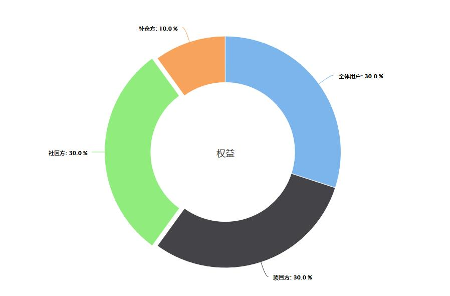

# binaryfuturs 二元期货(EOS)项目白皮书
## 1. 项目概述
二元期货项目是依托主流市场币价的基础上，求均值画出价格曲线；用户随时下单买涨或者买跌（并不影响市场走势），以分钟为单位在每分钟固定的秒数结算之前分钟的下单，以固定或者实时浮动赔率（0.6~1.4）对选对方向的订单进行赔付，持平则返还本金的一种数字货币期货合约交易，交易全程不收取手续费。
大致效果如下图：

## 2. 实现逻辑
### 2.1 K线（走势线）来源
本项目暂定取OKEX,火币,币安三家主流交易所的EOS-USDT交易对的实时交易数据，以求平均数的方式每秒记录一个当前价（保留6位小数）。
### 2.2 下单及结算
下单规则是上一个自然分钟的后20秒和当前分钟的前40秒可以下单当前分钟的单，到分钟结束（59秒）算奖，每分钟的40秒之后到59秒的订单算入下一个分钟周期。订单以订单成交时间时的均值价格为基点，以当前周期结束（当前分钟或下一分钟的59秒）时的价格为对比值。结束价大于基点价格时，对买涨的订单进行本金返还及赔付，赔付数额为【下单数量\*赔率】；结束价小于基点价格时，对买跌的订单进行本金返还及赔付，赔付数额为【下单数量\*赔率】；结束价等于基点价格时，对本周期的所有订单进行本金返但不再有赔付。
## 3. 平台特色
基于公平公正以及安全的前提，本项目采取大众参与及代码部分开源的方式操作。项目以JAVA开发，为防止部分可能性的攻击，除前端接口层和数据库层相关内容不进行开源外，剩余所有代码在GITHUB上开源，并且先开源后上线（线上运行的程序的代码一定是对应在GITHUB上开源的代码），开源部分包含：**价格采集及价格生成部分，订单部分，结算部分**等。

github地址：[https://github.com/binaryfuturs/binaryfuturs](https://github.com/binaryfuturs/binaryfuturs)
## 4. 权益
权益方分为三方，社区方、项目方和全体用户。社区方是指前期参与项目众筹及后期运营支持的成员；项目方是指项目开发及服务器技术维护方；全体用户为所有平台的注册用户。三方利益分配和占30%，具体如下：
1. 平台需要有底仓，做为短时赔付支撑，暂定底仓为3000个EOS，以众筹的形式筹集，整体占之后平台利润的30%，即以暂定的底仓3000个EOS计，众筹100个EOS的社区成员，占平台上线后的利润的1%，分红周期前期为每周，后期待平台运行稳定后调整成每天（分红分配代码会全部开源）。另项目利润的10%在一个周期内如果项目亏损则转入底仓，如果盈利，则按比例返还给项目方成员，直到返还总额等于众筹本金为止。
2. 项目方负责项目开发、服务器、域名、项目运维、前期财务报告（每周）等，占项目分红的30%。
3. 全体用户，每天随机时间对平台所有用户钱包进行快照一次(分红周期改为每天时，每四小时随机快照一次)，每个分红周期内对每次快照加和，以所有用户的加和再整体加合为基数，计算每个用户所占比例对该周期内平台利润的30%进行分红。

## 5. 路线图

|	时间段	|	工作内容	|	线上任务	|
|--	|--	|--	|
|	2019-3-20 ~ 2019-3-31	|	EOS钱包开发 平台注册及充值（众筹充值）开发	|	白皮书编写 域名注册	|
|	2019-4-1 ~ 2019-4-10	|	平台注册及充值（用户充值）开发 K线数据及均值计算开发 前台呈现页面开发	|	众筹部分上线、公测 开始众筹	|
|	2019-4-11 ~ 2019-4-20	|	用户提币开发 下单及订单管理开发 体验金开发	|	众筹&众筹结果发布 K线页上线	|
|	2019-4-21 ~ 2019-4-30	|	结算开发 完善前端功能页面	|	众筹&众筹结果发布 用户提币、注册送体验金上线	|
|	2019-5-1 ~ 2019-5-10	|	BUG修改 分红开发	|	众筹&众筹结果发布 整体上线试运行	|
|	2019-5-11 ~ 2019-5-20	|	项目维护	|	正式上线运行	|

by binaryfuturs 2019-3-21

